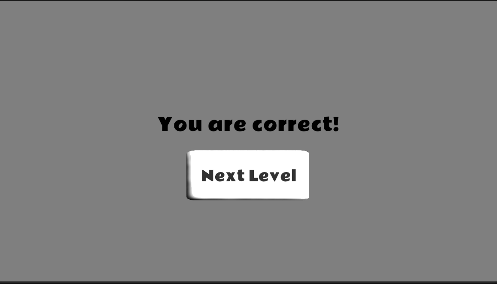

# PoppiSubitize – Research Game Showcase  

This repository showcases *PoppiSubitize*, an educational math learning game developed in **Unity (C#)** as part of an academic research project at Adelphi University.  
Due to confidentiality requirements, **no source code or research-sensitive files are included here.**  
This page serves as a portfolio summary of the work I contributed to the project.

---

##  About the Project  
PoppiSubitize is designed to help young learners build subitizing skills — the ability to instantly recognize small quantities without counting. The game presents visual patterns for a very short time, requiring fast perception and accuracy.

The project is part of an early math research initiative supported by faculty collaborators and follows an iterative, playtesting-driven development approach.

---

##  My Contributions  
I worked as a **Gameplay Programmer** and **Unity Developer**, contributing:

### ✔ Gameplay Systems  
- C# scripts for generating enemy/number patterns  
- Difficulty scaling logic (easy → hard patterns)  
- Time-based display mechanics (flash durations, delays)

### ✔ UI & Interaction Design  
- Menu screens, transitions, and instructional UI  
- Visual feedback animations and success/fail indicators  
- Back button, navigation logic, and flow polish

### ✔ Level & Pattern Logic  
- Multiple pattern generation rules (linear, grouped, random)  
- Built tools for researchers to configure gameplay settings  
- Integrated data collection workflow

### ✔ Collaboration  
- Worked closely with research faculty  
- Iterated based on student testing feedback  
- Improved the game's usability and performance over time

---
## 📸 Screenshots / Media 
### Gameplay Screenshots

---

##  Why No Code?  
This project is part of an academic study.  
To protect research integrity and privacy, **source code and game assets cannot be shared publicly**.

I am happy to discuss my technical contributions in an interview.

---

##  Technology Used  
- **Unity** (2D/3D workflows)  
- **C# scripting**  
- Unity UI Toolkit & Animator  
- GitHub version control  
- Iterative prototyping workflows

---

##  Contact  
If you'd like to learn more about my work on this project:

**Sparsh Choudhary**  
📧 sparshchoudhary@mail.adelphi.edu  
GitHub: https://github.com/Nex-ell

